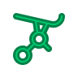
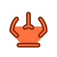
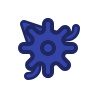
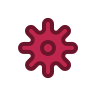
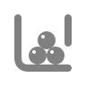
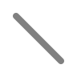
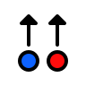
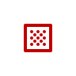
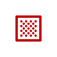
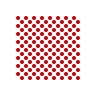

How to use the Turing Tumble Simulator
======================================

The simulator runs right in your browser, so there's nothing to install. It also saves its state to the URL, so you can bookmark a board or share the URL and it should bring back the interface just like it was, except that all the balls will be returned to the top. You can also save the configuration of the board to a file and restore it, see the entries for the upload and download tools below. Note that even though the information in the URL is compressed, it can get really long, so you may want to use a URL shortening service before sharing. The simulator always launches with a standard board that mimics the layout of a real Turing Tumble, but you can change it as much as you want by selecting tools from the toolbars on either side of the window.

Tools
-----

&nbsp;&nbsp;&nbsp;&nbsp;Icon&nbsp;&nbsp;&nbsp;&nbsp; | Description
---------------------------------------------------- | :----------
 | The **hand tool** allows you to manipulate things. Some parts can be flipped or rotated by clicking on them, and you can also drag parts and balls to different locations. Other parts like drops and turnstiles have special actions that happen when you click or drag the center. See the entries on those parts for details. Hold down control and drag to pan the view around, or just drag an empty part of the board. You can also resize the board by grabbing it by the edges.
 | The **erase tool** removes parts from the board. Click on a part to remove it. Start on a part and drag to remove many parts at once. Click on a spot without a part to turn it into a blank square (with no pin in the middle), and click again to restore the pin.
 | The **ramp tool** adds a ramp part to the board. Ramps accept balls from both directions, but only direct them in one specific direction. By default the ramp tool places ramps that point right, but you can switch this by selecting the ramp tool and clicking the button again. The part in the toolbar will flip, and ramps you add to the board will now point left. You can switch back and forth as much as you want by clicking the ramp button while it's selected. You can also place ramps on the board in any direction and flip them later using the hand tool. You can drag across the board with the ramp tool to place a lot of ramps at once. Clicking on a ramp that's already pointing in the same direction will remove it.
 | The **crossover tool** adds a crossover part to the board. A crossover accepts a balls from either side and directs it to the opposite side.
 | The **interceptor tool** adds an interceptor part to the board. An interceptor catches balls from either side and stops them from moving further down the board.
 | The **bit tool** adds a bit part to the board. A bit accepts balls from either side and directs them to one side, just like a ramp. But as it does this, it switches so that it will direct the next ball to the other side. Just like with the ramp tool, you can switch the direction of the bits your placing by clicking the tool while it's already selected. You can also place bits on the board and flip them later with the hand tool.
 | The **gearbit tool** adds a gearbit part to the board. Gearbits work just like bits except that you can connect them together with gears. All connected gearbits will always point the same way.
 | The **gear tool** adds a gear part to the board. Gears don't interact with balls, all they do is connect gears together. Unlike all the parts above, gears can be placed on any square of the grid.
 | The **ball tool** allows you to add and remove balls. Clicking in a place on the board without a ball will add one, and clicking on a place where there is a ball will remove it. Whenever you create a ball, it gets assigned the color of the nearest drop (see below). If you hover with the ball tool over a drop, you'll see a number that counts the number of balls currently in the drop. It does not count any balls that are below the bottom of the drop.
 | The **drop tool** adds a drop part to the board. Drops release balls one by one. You can add balls to the drop, and then release one by either clicking in the middle of the drop with the hand tool or using a turnstile. You can change the colors of all the balls in the drop by dragging with the hand tool from the center of the drop. A color wheel will appear, and by rotating the cursor around it you can pick the color you want.
 | The **turnstile tool** adds a turnstile part to the board. Turnstiles receive balls from either side and route them to one side, but each time a ball goes through, the nearest drop will release another ball. You can tell which drop the turnstile connects to because the circle in the center of the turnstile will have the same color as the balls in the drop.
 | The **side tool** adds a vertical wall to the board, which blocks balls from travelling horizontally. By default, the wall will be on the left of whichever grid unit you add the part to, but you can switch it to the right either by clicking on the tool again when it's selected or by flipping parts on the board with a hand tool. If you flip one wall in a vertical line of parts, they will all flip together.
 | The **slope tool** adds angled slopes that direct balls horizontally across the board. When you put slopes next to each other, they connect into a continuous line up to six units long, but you can extend the same slope further by moving up or down one row and adding more slope units. By default, slopes direct balls to the right, but you can switch them to direct balls to the left by clicking on the tool when it's selected or by flipping parts on the board with a hand tool. If you flip one slope in a horizontal line, the whole line will flip as one unit.

Actions
-------

&nbsp;&nbsp;&nbsp;&nbsp;Icon&nbsp;&nbsp;&nbsp;&nbsp; | Description
---------------------------------------------------- | :----------
 | The **schematic action** toggles between physical simulation mode and schematic simulation mode. In physical mode, the parts look and act like parts of a real Turing Tumble. In schematic mode, they have a simpler look and action, but the balls should follow the same overall path as they would in physical mode.
 | This makes the view of the board bigger, so you can see the parts in more detail.
 | This makes the view of the board smaller, so you can see more parts at once.
 | This zooms in or out so the whole board is showing at the largest possible size.
 | This makes the simulation run faster.
 | This makes the simulation run slower.
 | This returns all the balls on the board to their appropriate drops.
 | This opens an closes an extra toolbar with additional actions that aren't used as much.
 | This clears the board and resets it to the same standard layout as a real Turing Tumble.
 | This clears the board and sets up a slightly larger version of the standard layout.
 | This clears the board and sets up an even larger version of the standard layout.
 | This removes all parts and balls from the board without changing its size.
 | This removes all the balls from the board but leaves all the parts in place.
 | This downloads the state of all the parts on the board as a PNG image. Each part is represented by a pixel in the image, with the color determining the type of part and its state. You can edit this image and upload it again, and as long as the colors you use are close, it should work. Avoid changing lines at the bottom that have a blue pixel on the left, since these contain metadata about the board that can't be encoded in the individual pixels.
 | This allows you to upload a PNG image, which will replace the entire state of the board.

Links
-----

&nbsp;&nbsp;&nbsp;&nbsp;Icon&nbsp;&nbsp;&nbsp;&nbsp; | Description
---------------------------------------------------- | :----------
 | This should link to this documentation, although it may not work unless the app is being hosted on github pages.
 | If the app is hosted on github pages, this will link to the forked repository it's based on, otherwise it will link to the original repository.
 | This links to the Turing Tumble website.

